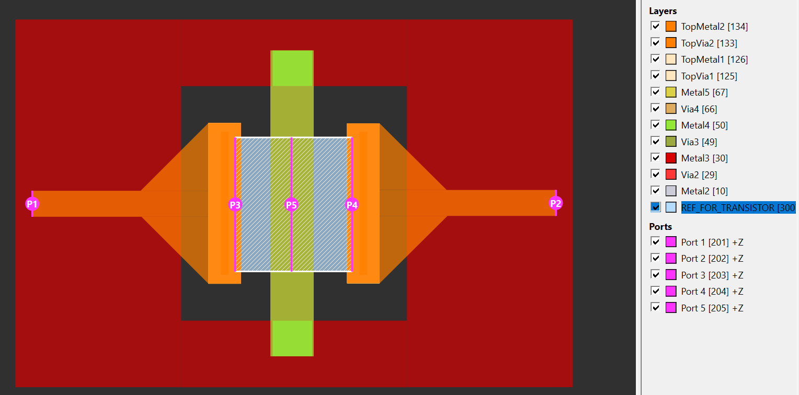

# Transistor core with 3 via ports at Base/Collector/Emitter (gds2openEMS)

This is the openEMS/FDTD counterpart of the `core_transistor_3port_bce`
example in `gds2palace_ihp_sg13g2` — same transistor test cell, same GDSII
file, same 5-port idea: extract a parasitic S-parameter network for an SiGe
HBT transistor core, with 3 of the 5 ports going directly to the Base,
Collector and Emitter terminals instead of only exposing 2 external RF pads.

It extends the baseline `../numThreads` example (2 pad via ports + 2 in-plane
ports on `Metal2`, 4 ports total) the same way the Palace version does: the 2
in-plane ports are replaced with 3 vertical via ports referenced to a new
artificial common ground plane, `REF_FOR_TRANSISTOR`.



## Ports

```python
simulation_ports.add_port(simulation_setup.simulation_port(portnumber=1, voltage=1, port_Z0=50, source_layernum=201, from_layername='Metal3', to_layername='TopMetal2', direction='z'))
simulation_ports.add_port(simulation_setup.simulation_port(portnumber=2, voltage=1, port_Z0=50, source_layernum=202, from_layername='Metal3', to_layername='TopMetal2', direction='z'))
simulation_ports.add_port(simulation_setup.simulation_port(portnumber=3, voltage=1, port_Z0=50, source_layernum=203, from_layername='Metal2', to_layername='REF_FOR_TRANSISTOR', direction='z'))
simulation_ports.add_port(simulation_setup.simulation_port(portnumber=4, voltage=1, port_Z0=50, source_layernum=204, from_layername='Metal2', to_layername='REF_FOR_TRANSISTOR', direction='z'))
simulation_ports.add_port(simulation_setup.simulation_port(portnumber=5, voltage=1, port_Z0=50, source_layernum=205, from_layername='Metal2', to_layername='REF_FOR_TRANSISTOR', direction='z'))
```

| Port | Layer | From → To | Purpose |
|---|---|---|---|
| 1 | 201 | Metal3 → TopMetal2 | outer RF pad |
| 2 | 202 | Metal3 → TopMetal2 | outer RF pad |
| 3 | 203 | Metal2 → REF_FOR_TRANSISTOR | transistor Base |
| 4 | 204 | Metal2 → REF_FOR_TRANSISTOR | transistor Collector |
| 5 | 205 | Metal2 → REF_FOR_TRANSISTOR | transistor Emitter |

All 3 transistor-terminal ports reference the same `REF_FOR_TRANSISTOR`
plane, so they behave as ordinary lumped ports to a shared node — no gap
between two conductor edges is needed the way an in-plane port requires,
which is what makes a genuine 3-terminal port set at the device possible.

Note: the ports have been created with zero xy area (i.e. vertical sheet) because that was a requirement in the original gds2palace example. If you prefer that, you can also create ports with finite xy area in gds2palace, i.e. ports represented as volumes in the FDTD solver.

## Stackup (`SG13G2_100um_bce_ports.xml`)

This stackup is the full IHP SG13G2 metal/via stack from this repo's
standard openEMS stackup template
([`../parameterized_XML_stackup/SG13G2_parameterized.xml`](../parameterized_XML_stackup/SG13G2_parameterized.xml)),
including `Activ`/`Cont`/`Metal1`/`Via1` and the dual-layer `MIM_DK`+`MIM`
capacitor representation — even though this particular GDSII file only draws
`Metal2` and up, keeping the full stack means the file stays reusable
as-is for other layouts that do use those layers.

The one addition on top of that standard template:

```xml
<Layer Name="REF_FOR_TRANSISTOR" Type="sheet" Reference="SiO2" ReferenceEdge="Bottom" Material="PEC" Layer="300" Zmin="0.4" Zmax="0.4" />
```

Position is 0.4 µm above the top of `EPI` with `Material="PEC"` — exactly at
the top of `Activ`.

Ports 3/4/5 each span the resulting ~1.6 µm gap between the bottom of
`Metal2` and this artificial ground, passing through the `Via1`/`Metal1`/
`Cont`/`Activ` region — those layers are defined in the stackup (so they
still contribute z-mesh lines through that gap, see below) but have no
drawn geometry at the ports' xy location in this simplified test structure,
so no real conductor fills the gap; the lumped port is the only thing
bridging it.

## Mesh: `refined_cellsize`

The `REF_FOR_TRANSISTOR` footprint is small (~13.5 x 15.5 µm) and the 3 ports
on it sit only ~6.5-7 µm apart, noticeably tighter than the outer-pad
spacing. `refined_cellsize` is set to **0.5 µm**, the same value as the
baseline mpa_core example in `../numThreads`. A dry run confirms this
resolves the 3-port region with roughly a dozen cells across each
port-to-port gap, and gives a 0.4 µm minimum z-cell driven by the
`REF_FOR_TRANSISTOR` position itself; keeping the (undrawn) `Cont`/`Metal1`/
`Via1` layers in the stackup also adds a couple of extra z-mesh lines
through the port gap, since `Type="via"` layers are meshed whether or not
they have drawn geometry at a given xy location:

```
Mesh cells by axis (total 746 kcells):
 x = 112, y = 90, z = 74
Smallest cell size: dx = 0.4813, dy = 0.4153, dz = 0.4000
```

If you tighten the port spacing or shrink the `REF_FOR_TRANSISTOR` footprint
in your own layout, reduce `refined_cellsize` accordingly and check the
resulting cell counts/`AppCSXCAD` preview before running a full sweep.

## Usage

```bash
source ~/venv/openems/bin/activate
python openems_core_bce_ports.py
```

This previews the model in AppCSXCAD before the first port excitation, then
runs all 5 port excitations and writes a 5-port Touchstone file
(`openems_core_bce_ports.s5p`). Connection for B,C,E is at ports 3,4,5 respectively.
