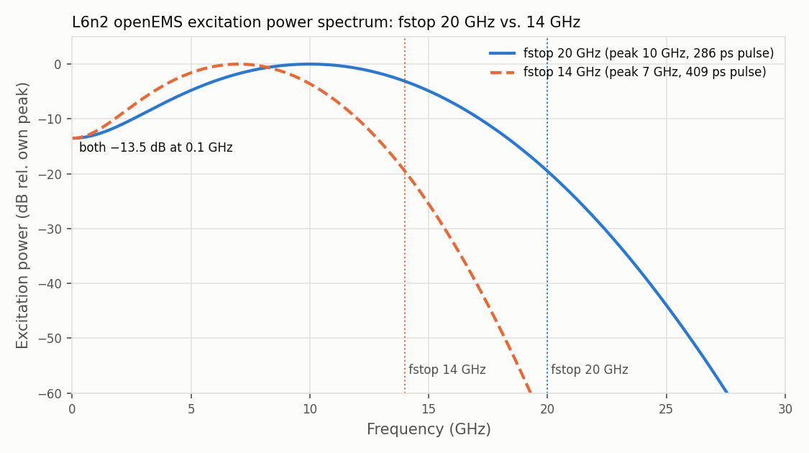

# L6n2 inductor with openEMS vs. measurement (IHP SG13G2)

This study compares openEMS FDTD simulations of the L6n2 spiral inductor with a de-embedded measurement, one model setting at a time. It is the openEMS counterpart of the gds2palace study in `gds2palace_ihp_sg13g2/more_examples/measured_vs_simulated/more_accurate_models_L6n2`, and uses the same layout, measurement and differential L/R/Q evaluation.

## Setup

- **Layout:** `L6n2_with_ports.gds`, a 4-turn octagonal spiral on TopMetal2 (8 µm line width), with TopMetal1 underpasses connected through 8 TopVia2 arrays of 4×4 vias.
- **Ports:** via ports P1 and P2 from SUBGND (ideal ground plane) to TopMetal1, at the two leads.
- **Stackups:**
  - `openEMS_SG13G2_200um.xml`: planar, with SiO2 + passivation filling the gaps between the TopMetal2 traces;
  - `openEMS_SG13G2_200um_passicut.xml`: passivation cut, used in Step 4.
- **Solver settings:** PEC boundaries with 250 µm margin, 20 cells per wavelength at fstop, and via array merging with `merge_polygon_size = 2`.
- **Mesh:** `refined_cellsize` is the mesh size on the conductors: 2 µm, 1 µm or 0.5 µm.
- **Software:** gds2openEMS 0.5.0 (needed for `settings['fill_factor_correction']`) and openEMS v0.0.36. All runs were on HPZ2; solve times below are for both port excitations together.
- **Measurement:** `meas_L5_6n2_THRU_deemb.S2P`, de-embedded. It has a differential SRF of **11.07 GHz**, a peak Q of **15.96 at 4.71 GHz**, and a low-frequency differential resistance of **4.55 Ω** at 0.1 GHz.

All plots show the differential L, Q and R, from Zdiff = Z11 − Z12 − Z21 + Z22 (same calculation as the Palace study). The bottom-right panel zooms in on the low-frequency resistance.

## Step 1: via array merging and the fill factor correction

Via array merging replaces each 4×4 via array by one block with the array's outline, roughly a 4× larger conductive cross section. The via conductivity in the stackup comes from the resistance of a single via, so merging lowers the via resistance.

**Expected size of the effect, from the Palace study:**
- 8 arrays of 16 vias at 1.1 Ω per via give 8/16 × 1.1 Ω = 0.55 Ω of via resistance in series.
- A 4× larger cross section removes about 0.4 Ω of that.

`settings['fill_factor_correction'] = True` scales the conductivity of each merged block by its fill factor (original via area / merged area), which is 0.28 here.

**Hand calculation:** to know the true DC resistance, the layout was also solved as a DC resistor network on a raster grid. That network has TopMetal1, TopMetal2 and the via blocks.

| DC network, 0.5 µm grid | R_DC | TopMetal2 | TopMetal1 | Vias |
|---|---|---|---|---|
| Merged vias, no correction | 4.38 Ω | 3.66 Ω | 0.55 Ω | 0.17 Ω |
| Merged vias with fill factor 0.28 | 4.78 Ω | 3.66 Ω | 0.55 Ω | 0.58 Ω |

The difference is 0.40 Ω, as expected. With the correction, the network converges to about 4.7 Ω on finer grids: 4.96 Ω at 1 µm, 4.78 Ω at 0.5 µm and 4.72 Ω at 0.25 µm. The measurement gives 4.55 Ω.

The openEMS runs are `run_L6n2_mesh1.py` and `run_L6n2_mesh1_mergecorrection.py`, both with a 1 µm mesh, fstop 20 GHz and the default end criterion of −40 dB:

| Model | R @ 0.1 GHz | R @ 1 GHz | L @ 1 GHz | Peak Q | SRF | Solve time |
|---|---|---|---|---|---|---|
| Measured | 4.55 Ω | 4.86 Ω | 5.01 nH | 15.96 @ 4.71 GHz | 11.07 GHz | |
| Via merge, no correction | 3.45 Ω | 3.86 Ω | 4.89 nH | 13.98 @ 3.50 GHz | 9.91 GHz | 556 s |
| Via merge + correction | 3.82 Ω | 4.24 Ω | 4.89 nH | 13.17 @ 3.65 GHz | 9.91 GHz | 534 s |

The correction adds 0.37 Ω, close to the expected 0.4 Ω. But both openEMS results are far below the hand calculation and the measurement: 3.82 Ω vs. about 4.7 Ω, with an offset of about 0.9 Ω. Inductance agrees well at low frequency, but the SRF and peak Q are too low (the passivation model, Step 4).

## Step 2: is the low resistance a mesh effect?

`run_L6n2_mesh0u5_mergecorrection.py` repeats Step 1's corrected model with a 0.5 µm mesh. The 2 µm run is `run_L6n2_mesh2_mergecorrection.py`.

| Mesh (via merge + correction, −40 dB) | R @ 0.1 GHz | L @ 1 GHz | Peak Q | SRF | Solve time |
|---|---|---|---|---|---|
| 2 µm | 4.42 Ω | 4.84 nH | 12.87 @ 4.40 GHz | 9.68 GHz | 111 s |
| 1 µm | 3.82 Ω | 4.89 nH | 13.17 @ 3.65 GHz | 9.91 GHz | 534 s |
| 0.5 µm | 3.85 Ω | 4.89 nH | 13.93 @ 3.95 GHz | 10.17 GHz | 3,987 s |

A finer mesh does not move the low-frequency resistance towards 4.7 Ω. The values scatter between 3.8 and 4.4 Ω without converging, so this is obviously not a mesh effect. The stackups were also checked: conductor conductivities, thicknesses and via fill factor are identical to the Palace model, which gives 4.69 Ω.

## Step 3: the energy end criterion

openEMS stops the simulation when the energy left in the model has dropped below `settings['energy_limit']`, which is −40 dB in all runs so far.

A synthetic testcase isolates the effect: a straight TopMetal2 line, 8 µm wide, with the same stackup, ports and 0.5 µm mesh, run at −40 dB and at −60 dB. Its resistance is known analytically from the sheet resistance.

| Test line | R @ 0.1 GHz | Analytic | Error | L |
|---|---|---|---|---|
| 300 µm, −40 dB | 0.505 Ω | 0.411 Ω | +23% | 161 pH |
| 300 µm, −60 dB | 0.412 Ω | 0.411 Ω | +0.2% | 171 pH |
| 600 µm, −40 dB | 1.040 Ω | 0.824 Ω | +26% | 312 pH |
| 600 µm, −60 dB | 0.819 Ω | 0.824 Ω | −0.6% | 336 pH |

At −40 dB, R and L at low frequency are off by 6–26%, and R even falls with frequency. At −60 dB, both are correct. A 45° line gave the same picture (0.475 Ω vs. 0.411 Ω at −40 dB), so the staircase approximation of diagonal traces is not the cause either.

`run_L6n2_mergecorrection_sweep.py` then repeats the L6n2 model (1 µm mesh, via merge + correction, fstop 14 GHz) at three end criteria:

| End criterion | Timesteps (pulse) | R @ 0.1 GHz | R @ 1 GHz | L @ 1 GHz | Peak Q | SRF | Solve time |
|---|---|---|---|---|---|---|---|
| −40 dB (fstop 20 GHz, Step 1) | about 165 k (176 k) | 3.82 Ω | 4.24 Ω | 4.89 nH | 13.17 @ 3.65 GHz | 9.91 GHz | 534 s |
| −40 dB | about 247 k (251 k) | 3.48 Ω | 4.46 Ω | 4.97 nH | 13.87 @ 5.08 GHz | 9.94 GHz | 689 s |
| −50 dB | about 301 k (251 k) | 4.56 Ω | 5.12 Ω | 4.85 nH | 13.89 @ 4.27 GHz | 9.93 GHz | 701 s |
| −60 dB | about 471 k (251 k) | **4.68 Ω** | 5.16 Ω | 4.83 nH | 13.76 @ 4.27 GHz | 9.92 GHz | 1,201 s |

At −60 dB, the low-frequency resistance is 4.68 Ω: it matches the DC hand calculation (about 4.7 Ω) and the Palace result (4.69 Ω), and it is close to the measurement (4.55 Ω). The two −40 dB runs don't even agree with each other (3.82 Ω and 3.48 Ω), although they differ only in fstop, which changes the excitation pulse and the coarse outer mesh. SRF is unaffected by the end criterion.

Why −40 dB fails is visible in the raw openEMS signals. The excitation pulse is not short of low-frequency content: its power at 0.1 GHz is 13.5 dB below its peak, for both the 14 GHz and the 20 GHz pulse.

The problem is when the run stops. Timesteps are read from the end of the port probe signal (time step 1.63 fs); the value in brackets is the length of the excitation pulse. Both −40 dB runs stop at about the end of their excitation pulse, while the port 2 voltage is still only 36–38 dB below its maximum. The −40 dB run with fstop 14 GHz is identical to the −60 dB run up to that point. The −60 dB run continues to about 770 ps, until port 2 is 77 dB below its maximum.

On a linear scale, what the −40 dB runs miss is a small exponential tail after the pulse, about 0.05 µV compared with a peak of about 20 µV. Its fitted time constant is 34–42 ps. That is the same order as the coil's L/R time constant with both 50 Ω ports connected: 4.82 nH / (100 Ω + 4.7 Ω) ≈ 46 ps. This tail is the inductor's low-frequency response, and the −40 dB runs stop just as it begins.

**Conclusion:** for the low-frequency resistance of an inductor, use `settings['energy_limit'] = -60`, or at least −50 dB. On the 1 µm mesh this costs about 1.7× the solve time of −40 dB.

## Step 4: planar vs. cut passivation

With the resistance fixed, the SRF is still too low: 9.9 GHz simulated vs. 11.07 GHz measured. The planar stackup fills the gaps between the TopMetal2 traces completely with SiO2 + passivation, which overestimates the sidewall capacitance between the closely spaced turns. `openEMS_SG13G2_200um_passicut.xml` sizes the SiO2 for the valleys between the traces instead, cutting TopMetal2 about halfway.

`run_L6n2_mergecorrection_passicut_sweep.py` runs this stackup with 2 µm and 1 µm mesh, using the −60 dB end criterion from Step 3. The comparison with the planar stackup uses the coarse 2 µm mesh for both, from `run_L6n2_mergecorrection_sweep.py` and `run_L6n2_mergecorrection_passicut_sweep.py`:

| Model (via merge + correction, −60 dB) | R @ 0.1 GHz | R @ 1 GHz | L @ 1 GHz | Peak Q | SRF | Solve time |
|---|---|---|---|---|---|---|
| Measured | 4.55 Ω | 4.86 Ω | 5.01 nH | 15.96 @ 4.71 GHz | 11.07 GHz | |
| Planar passivation, 2 µm | 4.66 Ω | 5.18 Ω | 4.81 nH | 13.28 @ 4.30 GHz | 9.69 GHz | 219 s |
| Passivation cut, 2 µm | 4.66 Ω | 5.16 Ω | 4.81 nH | 14.31 @ 4.87 GHz | 10.80 GHz | 361 s |

At the same 2 µm mesh, the cut passivation moves the SRF from 9.7 GHz to 10.8 GHz, and the peak Q from 13.3 at 4.3 GHz to 14.3 at 4.9 GHz, both closer to the measurement. The low-frequency resistance (4.66 Ω) and the inductance are unchanged, as expected for a change of dielectric only.

Refining to 1 µm gives the final result:

| Model (passivation cut, via merge + correction, −60 dB) | R @ 0.1 GHz | R @ 1 GHz | L @ 1 GHz | Peak Q | SRF | Solve time |
|---|---|---|---|---|---|---|
| Measured | 4.55 Ω | 4.86 Ω | 5.01 nH | 15.96 @ 4.71 GHz | 11.07 GHz | |
| 2 µm mesh | 4.66 Ω | 5.16 Ω | 4.81 nH | 14.31 @ 4.87 GHz | 10.80 GHz | 361 s |
| 1 µm mesh | **4.68 Ω** | **5.14 Ω** | **4.81 nH** | **14.52 @ 4.72 GHz** | **10.93 GHz** | 8,469 s |

The final model agrees with the measurement within 3% in low-frequency resistance, 4% in inductance, 1.3% in SRF and 9% in peak Q. The peak Q frequency is 4.72 GHz vs. 4.71 GHz measured. The 2 µm mesh is already close, at about 1/23 of the solve time.

## Comparison: measurement, openEMS and gds2palace

Both solvers at 2 µm mesh, the accuracy vs. cost winner in both studies:

- **openEMS:** passivation cut, via merge + correction, −60 dB end criterion. In Step 4, the 1 µm mesh gained only 0.1 GHz in SRF and 0.2 in peak Q, at 23× the solve time.
- **Palace:** the model the gds2palace study recommends: conformal passivation, filled metals (volume mesh), via merge + correction. That study found its 1 µm run changed very little at twice the cost. Its S-parameters are copied to `results/palace_L6n2_with_ports_2um_passi3D.s2p`.

| Model (2 µm mesh) | R @ 0.1 GHz | R @ 1 GHz | L @ 1 GHz | Peak Q | SRF | Solve time |
|---|---|---|---|---|---|---|
| Measured | 4.55 Ω | 4.86 Ω | 5.01 nH | 15.96 @ 4.71 GHz | 11.07 GHz | |
| openEMS: passivation cut, −60 dB | 4.66 Ω | 5.16 Ω | 4.81 nH | 14.31 @ 4.87 GHz | 10.80 GHz | 6 min 1 s |
| Palace: conformal passivation, filled metals | 4.69 Ω | 5.07 Ω | 4.90 nH | 14.67 @ 4.60 GHz | 10.96 GHz | 34 min 29 s |

The two solvers agree with each other within:

- 0.6% in low-frequency resistance;
- 1.9% in inductance;
- 2.5% in peak Q;
- 1.5% in SRF.

Both deviate from the measurement the same way: low-frequency resistance about 3% high, inductance 2–4% low, and peak Q 8–10% low. The SRF is 1.0% low for Palace and 2.4% low for openEMS.

Note that the two use different passivation models: Palace uses the conformal 3D passivation from derived layers, openEMS the passivation cut stackup. The openEMS solve time is the sum of both port excitations on HPZ2; the Palace solve time is the value reported in the gds2palace study.

## Files

- `run_*.py`: the openEMS model scripts. Results go to `output/`, which is not in git.
- `results/*.s2p`: the S-parameters used in this README. `palace_L6n2_with_ports_2um_passi3D.s2p` is copied from the gds2palace study.
- `results/plot_study.py`: regenerates the L/Q/R plots in `results/plots/` from those files.
- `results/plot_time_signals.py`: regenerates the excitation spectrum and port voltage plots. It needs the raw time signals in `output/`, so rerun `run_L6n2_mesh1_mergecorrection.py` and `run_L6n2_mergecorrection_sweep.py` first.
