# L6n2 inductor with openEMS vs. measurement (IHP SG13G2)

This study looks for the best possible model with highest accuracy for an inductor example, including comparison to measured data. There is a similar study for the gds2palace FEM workflow and some aspects are similar, but there is also **one important model setting specific to the FDTD method** used here.

If you can't wait ... the best case result and comparison to measured and Palace FEM is at the end of this document.

These potential error sources that are investigated, to get most accurate results:

### Energy limit (FDTD simulation end criteria)
We will see that the energy limit (FDTD stop criteria) is a critical model parameter here, which makes a real difference in R and Q at these frequencies. It deserves more attention, so this is investigated in detail.

### Over-estimate of via cross section due to via array merging
In most models, we want to merge via arrays into bigger blocks, to speed up simulation. Leaving all individual vias would be more accurate, causing much more complex mesh and increase simulation time. Via array merging replaces the individual vias by their outer bounding box, and here's the problem: the effective total cross section is now much larger than before, so this under-estimates the resulting via resistance. Only a minor error in many models, because the relative impact of via resistance is small. However, in this model investigated here, it does show up in results, and we will use a new option in gds2openEMS to restore the correct via resistance by applying a correction factor internally.

### Conformal passivation
The stackup used so far covers TopMetal2 with another thick **flat** layer of SiO2 plus Passivation. This is efficient for simulation, but the gds2palace study had clearly shown that this over-estimates the sidewall capacitance for closely spaced TopMetal2 conductors.  
An alternative stackup is investigated, for more realistic results. This is **not** the same as used for gds2palace, because we need to consider the FDTD method requirements also.


### Conductors model: surface vs. filled volumes ("mesh inside") 
The FDTD flow with gds2openEMS always used filled metals (volumes with conductivity), so this topic from the FEM study is not relevant here.

## Layout and setup

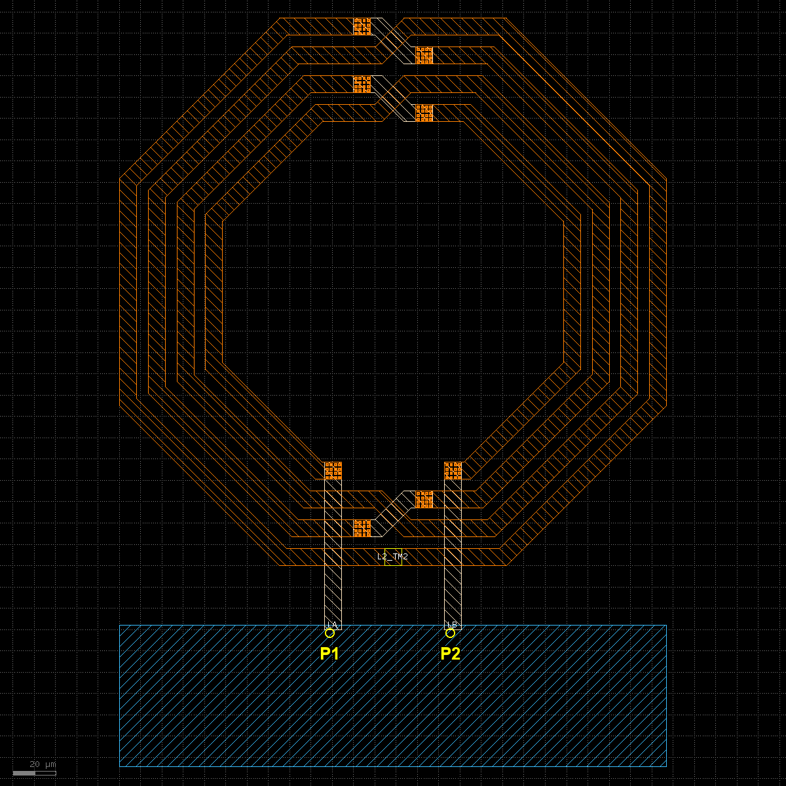

- **Layout:** `L6n2_with_ports.gds`, a 4-turn octagonal spiral on TopMetal2 (8 µm line width), with TopMetal1 underpasses connected through 8 TopVia2 arrays of 4×4 vias.
- **Ports:** via ports P1 and P2 from SUBGND (ideal ground plane) to TopMetal1, at the two leads.
- **Stackups:**
  - `openEMS_SG13G2_200um.xml`: planar, with SiO2 + passivation filling the gaps between the TopMetal2 traces;
  - `openEMS_SG13G2_200um_passicut.xml`: passivation cut, see [Planar vs. cut passivation](#planar-vs-cut-passivation).
- **Solver settings:** PEC boundaries with 250 µm margin, 20 cells per wavelength at fstop, and via array merging with `merge_polygon_size = 2`.
- **Mesh:** `refined_cellsize` is the mesh size on the conductors: 2 µm or 1 µm, plus one run at 0.5 µm.
- **Software:** gds2openEMS 0.5.0 (needed for `settings['fill_factor_correction']`) and openEMS v0.0.36. All runs were on HPZ2; solve times below are for both port excitations together.
- **Measurement:** `meas_L5_6n2_THRU_deemb.S2P`, test fixture de-embedded

All plots show the differential L, Q and R, from Zdiff = Z11 − Z12 − Z21 + Z22, same calculation as the gds2palace study. The bottom-right panel zooms in on the low-frequency resistance.

## First rrror source: via array merging, solved by fill factor correction

The effect of via array merging was investigated for this inductor because we have several via arrays, and the 8 μm line width requires small via arrays with only 4x4 vias.  

With 8 via arrays and 16 vias each, we have a total of 8/16*1.1 Ohm nominal resistance from the vias = 0.55 Ohm. Via array merging replaces the individual vias by the overall bounding box, roughly a 4x increase in effective cross section. We expect to see a difference of ~ 0.4 Ohm, which sounds like a small effect only, but that is already ~10% of the total inductor resistance in this case (looking at DC values).

`settings['fill_factor_correction'] = True` scales the conductivity of each merged block by its fill factor (original via area / merged area), which is 0.28 here.

Two openEMS runs are compared, with and without the via array correction factor option that was introduced in gds2openEMS v0.5.0. Both use the planar stackup, a 1 µm mesh, fstop 14 GHz and the default end criterion of −40 dB:

| Model | R @ 0.1 GHz | R @ 1 GHz | L @ 1 GHz | Peak Q | SRF | Solve time |
|---|---|---|---|---|---|---|
| Measured | 4.55 Ω | 4.86 Ω | 5.01 nH | 15.96 @ 4.71 GHz | 11.07 GHz | |
| Via merge, no correction | 3.06 Ω | 4.03 Ω | 4.97 nH | 14.56 @ 5.04 GHz | 9.94 GHz | 643 s |
| Via merge + correction | 3.48 Ω | 4.46 Ω | 4.97 nH | 13.87 @ 5.08 GHz | 9.94 GHz | 689 s |

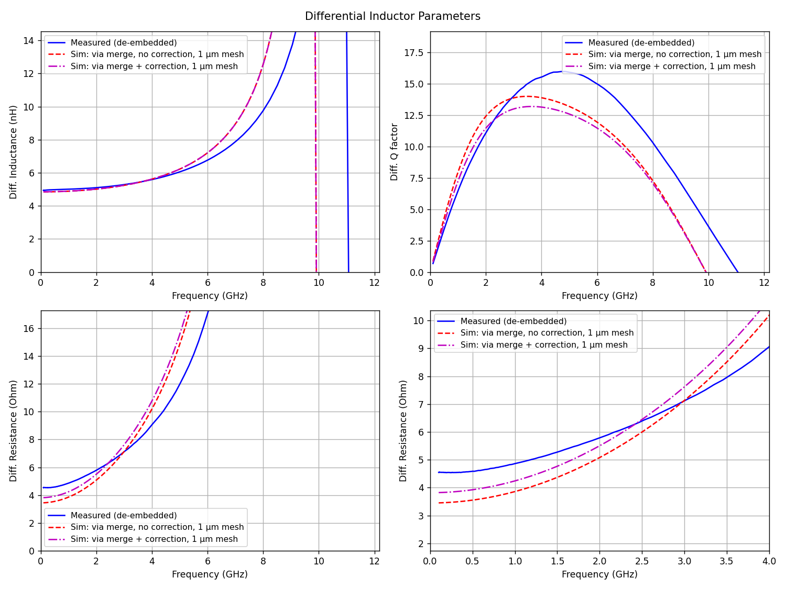

The correction adds 0.42 Ω, as expected (0.40 Ω). But both openEMS results are far below the hand calculation and the measurement: 3.48 Ω vs. about 4.7 Ω, with an offset of about 1.2 Ω. Inductance agrees well at low frequency, but the SRF and peak Q are too low (the passivation model, see [Planar vs. cut passivation](#planar-vs-cut-passivation)).

You might notice a weird shape of the Q factor curve, this is a side effect of the energy convergence issue discussed below as error source 2.

## Is the low resistance a mesh effect?

`run_L6n2_mergecorrection_sweep.py` also runs the corrected model from error source 1 with a 2 µm mesh, and `run_L6n2_mergecorrection_mesh0u5.py` runs it with a 0.5 µm mesh. All runs use the planar stackup, fstop 14 GHz and −40 dB:

| Mesh (via merge + correction, −40 dB) | R @ 0.1 GHz | L @ 1 GHz | Peak Q | SRF | Solve time |
|---|---|---|---|---|---|
| 2 µm | 3.74 Ω | 4.93 nH | 13.46 @ 4.90 GHz | 9.71 GHz | 118 s |
| 1 µm | 3.48 Ω | 4.97 nH | 13.87 @ 5.08 GHz | 9.94 GHz | 689 s |
| 0.5 µm | 3.44 Ω | 4.98 nH | 15.12 @ 5.25 GHz | 10.21 GHz | 5,506 s |

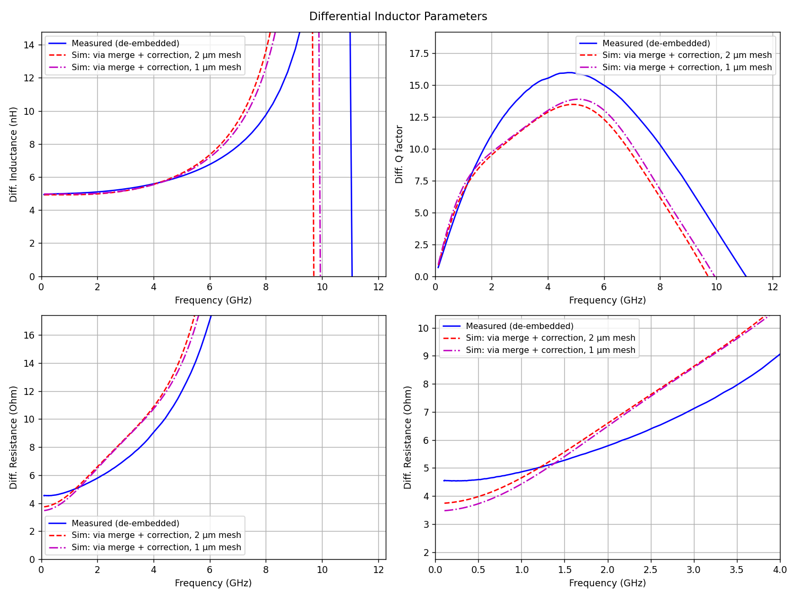

A finer mesh does not move the low-frequency resistance towards 4.7 Ω: 2 µm to 1 µm lowers it by 0.26 Ω, and 1 µm to 0.5 µm by only 0.04 Ω, at 8x the solve time. So this is obviously not a mesh effect. The 0.5 µm mesh raises peak Q and SRF somewhat, but at −40 dB these are still affected by error source 2 below. The stackups were also checked: conductor conductivities, thicknesses and via fill factor are identical to the Palace model, which gives 4.69 Ω.

Once the end criterion is fixed (error source 2 below), the mesh matters even less: at −60 dB, the planar model gives 4.66 Ω with the 2 µm mesh and 4.68 Ω with the 1 µm mesh.

## Second error source: the energy end criterion
### Synthetic testcase

openEMS stops the simulation when the energy left in the model has dropped below `settings['energy_limit']`, which is −40 dB in all runs so far.

A synthetic testcase isolates the effect: a straight TopMetal2 line, 8 µm wide, with the same stackup, ports and 0.5 µm mesh, run at −40 dB and at −60 dB. Its resistance is known analytically from the sheet resistance.

| Test line | R @ 0.1 GHz | Analytic | Error | L |
|---|---|---|---|---|
| 300 µm, −40 dB | 0.505 Ω | 0.411 Ω | +23% | 161 pH |
| 300 µm,**−60 dB** | 0.412 Ω | 0.411 Ω | +0.2% | 171 pH |
| 600 µm, −40 dB | 1.040 Ω | 0.824 Ω | +26% | 312 pH |
| 600 µm, **−60 dB** | 0.819 Ω | 0.824 Ω | −0.6% | 336 pH |

At −40 dB, R and L at low frequency are off by 6–26%, and R even falls with frequency. At −60 dB, both are correct. A 45° line gave the same picture (0.475 Ω vs. 0.411 Ω at −40 dB), so the staircase approximation of diagonal traces is not the cause either.

### Spectral power density in Gaussian pulse used for FDTD excitation

One idea regarding error sources was the **spectral distribution of the Gaussian pulse excitation**, which is symmetric around the center frequency, 7 GHz center frequency for 0-14 GHz sweep. The plot below shows the frequency spectrum of the excitation signal, we can see that there is enough spectral content down to DC. The power at 0.1 GHz is 13.5 dB below its spectral peak, not an issue for accuracy.

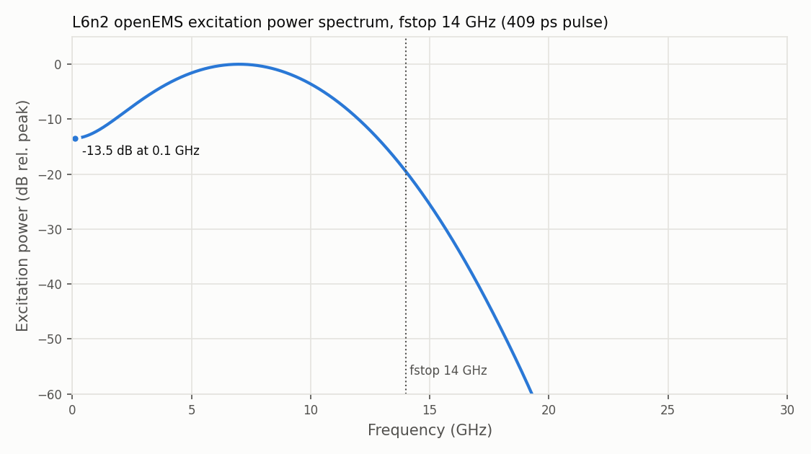

The problem is **not** the spectrum. 

### Energy end criterion, applied to inductor model

In FDTD, we terminate the simulation when the residual energy in the simulation volume is below a user defined threshold. For the simulations shown so far, that was -40dB.

```python
settings['energy_limit'] = -40          # end criteria for residual energy (dB)
```

We will now check the effect of this setting on results of our inductor simulation. `run_L6n2_mergecorrection_sweep.py` repeats the L6n2 model at three end criteria, all using the same 1 µm mesh, via merge + correction, fstop 14 GHz:

| End criterion | Timesteps | R @ 0.1 GHz | R @ 1 GHz | L @ 1 GHz | Peak Q | SRF | Solve time |
|---|---|---|---|---|---|---|---|
| −40 dB | about 247 k | 3.48 Ω | 4.46 Ω | 4.97 nH | 13.87 @ 5.08 GHz | 9.94 GHz | 689 s |
| −50 dB | about 301 k | 4.56 Ω | 5.12 Ω | 4.85 nH | 13.89 @ 4.27 GHz | 9.93 GHz | 701 s |
| −60 dB | about 471 k | **4.68 Ω** | 5.16 Ω | 4.83 nH | 13.76 @ 4.27 GHz | 9.92 GHz | 1,201 s |

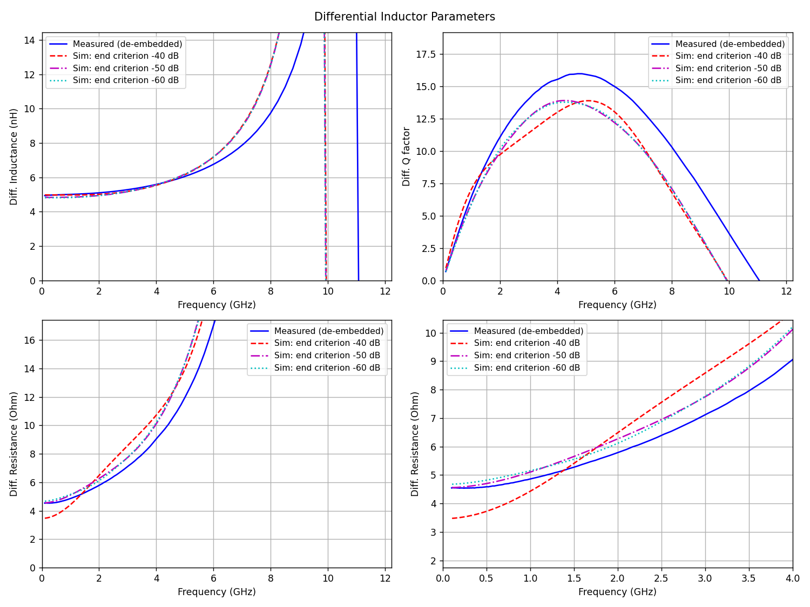

This shows a strong effect, the strange shape of Q factor disappears and the result for low-frequency series R changes as well.  

At −60 dB, the low-frequency resistance is 4.68 Ω: it matches the DC hand calculation (about 4.7 Ω) and the Palace result (4.69 Ω), and it is close to the measurement (4.55 Ω). SRF is unaffected by the end criterion.

The problem is when the run hits the energy criterion and stops. 

Below is a plot of time signals, read from the openEMS raw output files. Time step is 1.63 fs, and the excitation pulse lasts 409 ps (251 k steps). Timesteps above are read from the end of the port probe signal.

- The −40 dB run stops at the end of the excitation pulse (402 ps), while the port 2 voltage is still only 38 dB below its maximum.
- The −50 dB run continues to 491 ps (port 2 at −60 dB).
- The −60 dB run continues to 768 ps (port 2 at −77 dB).

All three runs are identical up to the point where each one stops; the end criterion only decides how much of the response is recorded before simulation stops and the time-domain data is FFT'ed.

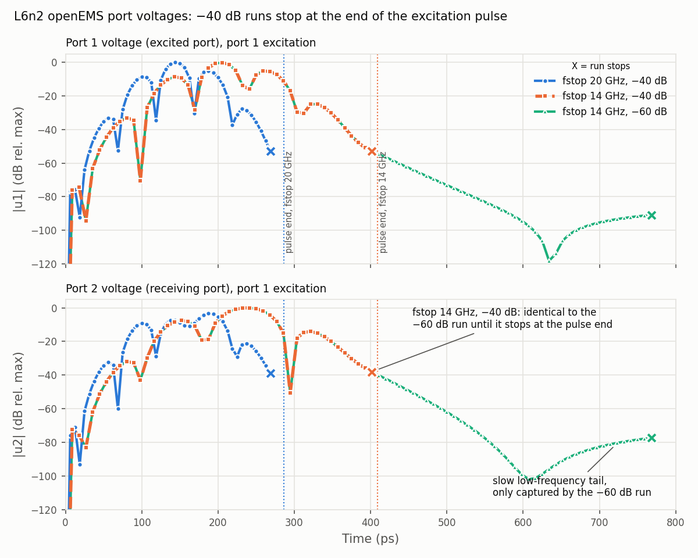

On a linear scale, what the −40 dB run misses is a small exponential tail after the pulse, about 0.03 µV at 420 ps compared with a peak of about 20 µV. Its fitted time constant is 34–42 ps. That is the same order as the coil's L/R time constant with both 50 Ω ports connected: 4.82 nH / (100 Ω + 4.7 Ω) ≈ 46 ps. This tail is the inductor's low-frequency response. The −40 dB run stops just as it begins; the −50 dB run captures most of it, which is why −50 dB is already close to the −60 dB result.

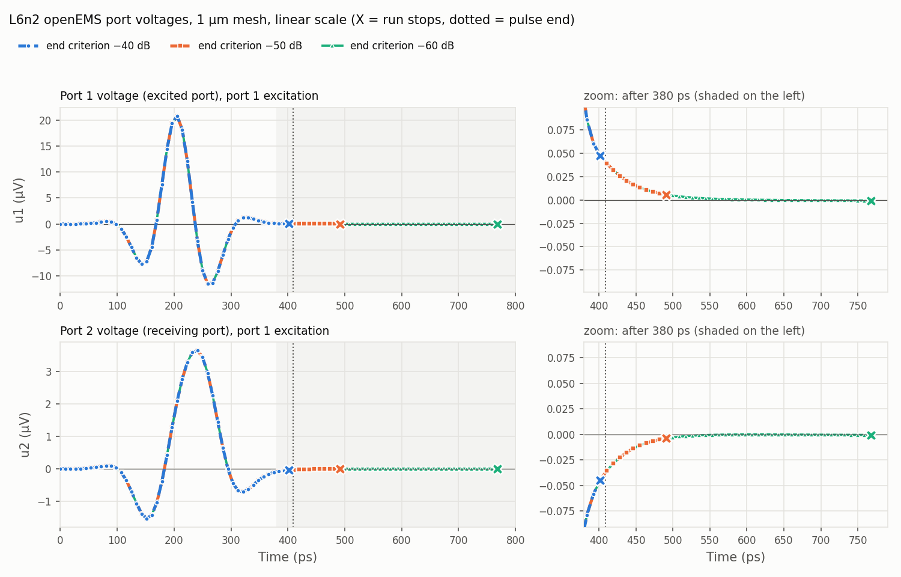

The error from stopping early is not a constant offset but a ripple across frequency. The difference to the −60 dB run oscillates, with a period set by how long the run continues after the centre of the excitation pulse (205 ps). S-parameters are referenced to the incident pulse, so a run that stops a time t after the pulse centre shows a ripple period of about 1/t:

- −40 dB stops 197 ps after the pulse centre, so about 5.1 GHz is expected. Its resistance difference crosses zero at 1.6, 4.6 and 7.3 GHz, swinging between −1.4 and +0.8 Ω below 7 GHz.
- −50 dB stops 286 ps after the pulse centre, so about 3.5 GHz is expected, with 5–10× smaller amplitude (within ±0.2 Ω below 7 GHz).

The low-frequency end is simply where the −40 dB ripple happens to be at its largest negative value.

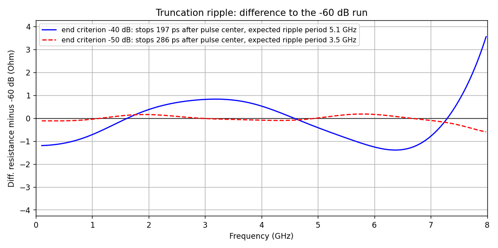

**Conclusion:** for the low-frequency resistance of an inductor, use `settings['energy_limit'] = -60`, or at least −50 dB. On the 1 µm mesh this costs about 1.7× the solve time of −40 dB.

## Third error source: non-planar dielectrics covering TopMetal2

With the resistance fixed, the SRF is still too low: 9.9 GHz simulated vs. 11.07 GHz measured. 

The planar stackup used so far fills the gaps between the TopMetal2 traces completely with SiO2 + passivation, which overestimates the sidewall capacitance between the closely spaced turns.

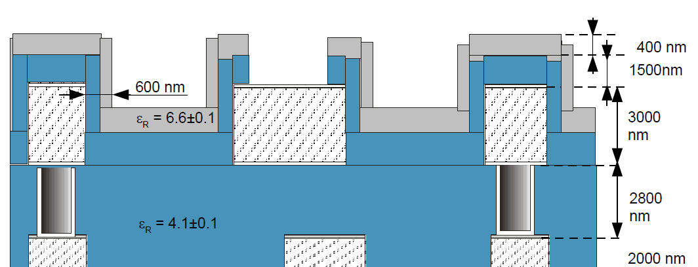

Planar stackup used so far with another thick block of SiO2 + Passivation above TopMetal2 top edge:
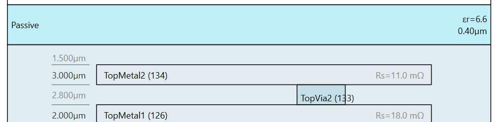


An alternative stackup, [openEMS_SG13G2_200um_passicut.xml](openEMS_SG13G2_200um_passicut.xml), leaves out the conformal cover over TopMetal2, and just places the correct thickness of SiO2 and Passivation in the **valleys** between TopMetal2 shapes, cutting TopMetal2 about halfway. This avoids the over-estimate of sidewall capacitance from the original stackup, and avoids the extra effort of dielectrics conformal around TopMetal2.

> **Difference to FEM using gds2palace:** The fully conformal stackup used for gds2palace FEM is **not** used here, because it has dielectric sidewall thickness of 600nm and would require really small refined_cellsize to resolve these details. That's not a good idea for FDTD because it would drive up mesh cell count heavily. Instead, we use the "passicut" method here, which was dropped in the gds2palace study. Different solver methods require different modelling strategies!

`run_L6n2_mergecorrection_passicut_sweep.py` runs this stackup with 2 µm and 1 µm mesh at −60 dB. For a comparison to the previous planar stackup (from `run_L6n2_mergecorrection_sweep.py`), we compare results at 2 µm refined_cellsize:

| Model (via merge + correction, −60 dB) | R @ 0.1 GHz | R @ 1 GHz | L @ 1 GHz | Peak Q | SRF | Solve time |
|---|---|---|---|---|---|---|
| Measured | 4.55 Ω | 4.86 Ω | 5.01 nH | 15.96 @ 4.71 GHz | 11.07 GHz | |
| Planar passivation, 2 µm | 4.66 Ω | 5.18 Ω | 4.81 nH | 13.28 @ 4.30 GHz | 9.69 GHz | 219 s |
| Passivation cut, 2 µm | 4.66 Ω | 5.16 Ω | 4.81 nH | 14.31 @ 4.87 GHz | 10.80 GHz | 361 s |

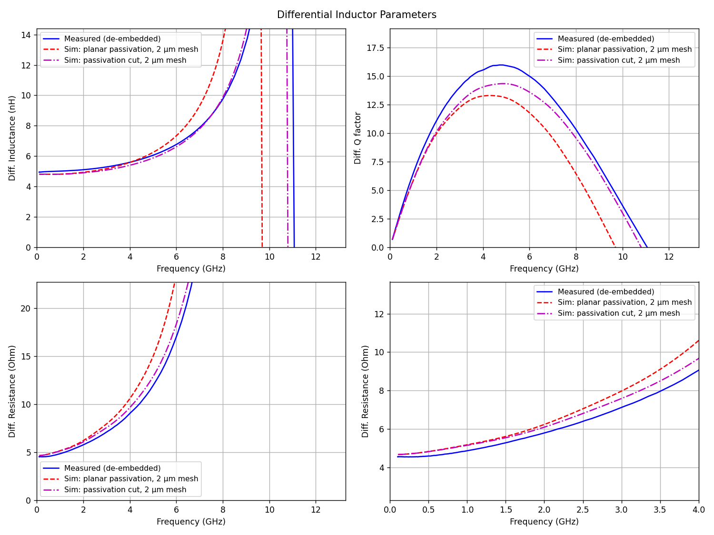

At the same 2 µm mesh, the cut passivation moves the SRF from 9.7 GHz to 10.8 GHz, and the peak Q from 13.3 at 4.3 GHz to 14.3 at 4.9 GHz, both closer to the measurement. The low-frequency resistance (4.66 Ω) and the inductance are unchanged, as expected for a change of dielectric only.

Refining to 1 µm gives the final result:

| Model (passivation cut, via merge + correction, −60 dB) | R @ 0.1 GHz | R @ 1 GHz | L @ 1 GHz | Peak Q | SRF | Solve time |
|---|---|---|---|---|---|---|
| Measured | 4.55 Ω | 4.86 Ω | 5.01 nH | 15.96 @ 4.71 GHz | 11.07 GHz | |
| 2 µm mesh | 4.66 Ω | 5.16 Ω | 4.81 nH | 14.31 @ 4.87 GHz | 10.80 GHz | 361 s |
| 1 µm mesh | **4.67 Ω** | **5.14 Ω** | **4.81 nH** | **14.54 @ 4.72 GHz** | **11.08 GHz** | 2,037 s |

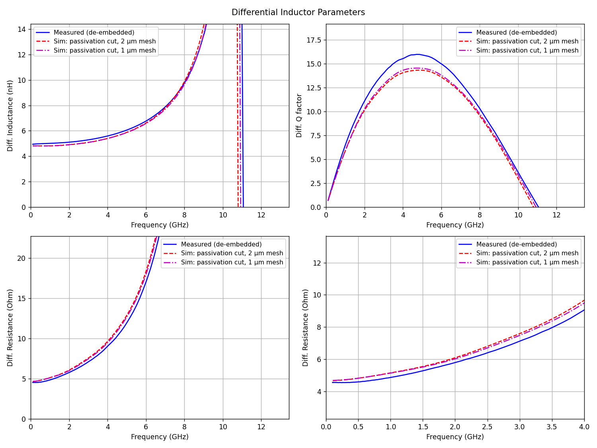

The final model agrees with the measurement within 3% in low-frequency resistance, 4% in inductance, 0.1% in SRF and 9% in peak Q. The peak Q frequency is 4.72 GHz vs. 4.71 GHz measured. The 2 µm mesh is already close, at about 1/6 of the solve time.

**This study also revealed an issue in the meshing algorithm in z direction**, which had caused an unexpected small cell size and slowed down simulation more than necessary. This was fixed by a code change: The 1 µm results shown here use the gds2openEMS version from 28-Sep-2026. The previous mesher placed a TopMetal2 subdivision line 0.1 µm from the passivation top, which is much below the refined_cellsize values. That tiny cell forced a small FDTD time step. With the old mesh, the same model gave SRF 10.93 GHz and peak Q 14.52, and took 8,469 s instead of 2,037 s. Resistance and inductance were the same.

## Mesh size revisited: 1 µm vs. 2 µm
Above, we had seen that the error in low frequency R and Q was not due to coarse meshing, and even refined_cellsize=2 µm was giving reasonable results. Note that this finding is **valid for this particular geometry with 8µm line width and 4 µm gap**. For geometries with narrower gaps, it might be necessary to go smaller in refined_cellsize, because that controls the "staircasing" by FDTD mesh on diagonal lines.

If you go too coarse, the staircase mesh will create rough edges and even shorts across the gap. To illustrate that staircasing, the plots below show the calculated E field in the gap and the mesh line overlay at 1 µm and 2 µm, from `run_L6n2_mergecorrection_passicut_fielddump.py`.

| 1 µm mesh | 2 µm mesh |
|---|---|
| 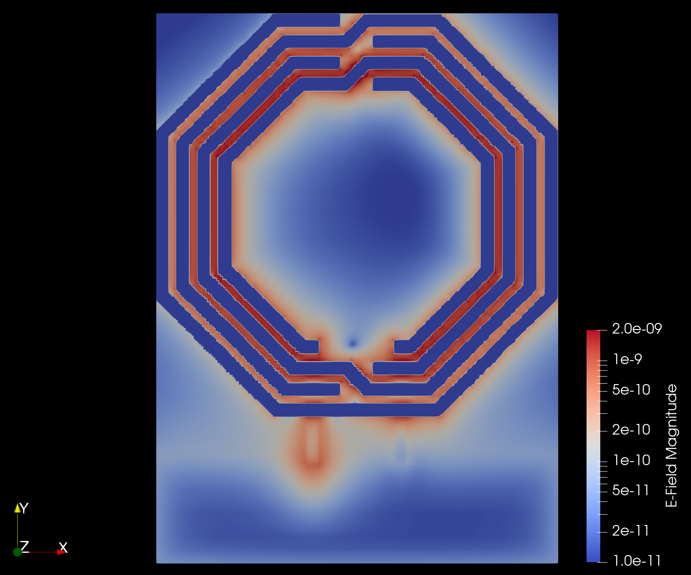 | 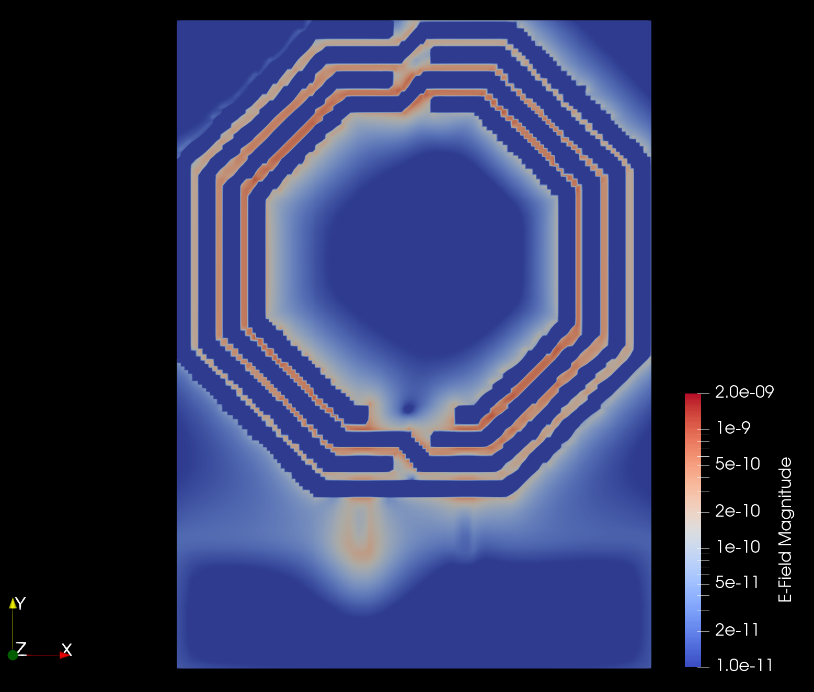 |
| 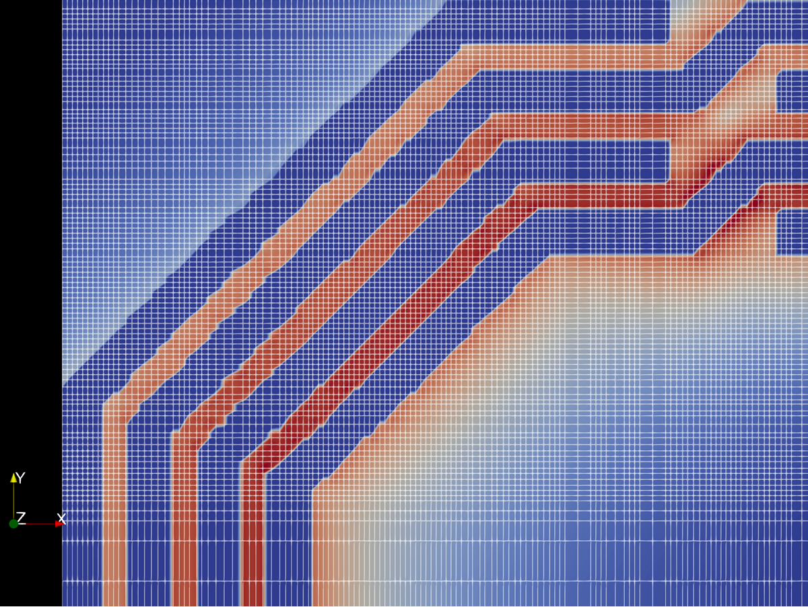 | 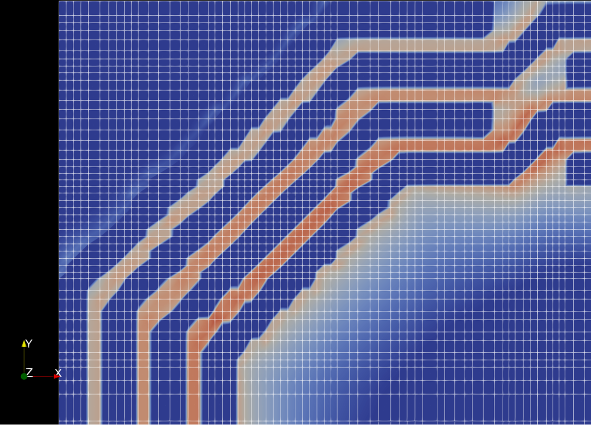 |

## Comparison: measurement, openEMS and gds2palace

The final openEMS model from [the third error source](#third-error-source-non-planar-dielectrics-covering-topmetal2) against gds2palace with the same passivation model:

- **openEMS:** passivation cut, via merge + correction, 1 µm mesh, −60 dB end criterion.
- **Palace:** passivation cut, filled metals (volume mesh), via merge + correction, 2 µm mesh, from the gds2palace L6n2 study (`more_accurate_models_L6n2_v2`). Its S-parameters are copied to `results/palace_L6n2_with_ports_2um_passicut.s2p`.

| Model | R @ 0.1 GHz | R @ 1 GHz | L @ 1 GHz | Peak Q | SRF | Solve time |
|---|---|---|---|---|---|---|
| Measured | 4.55 Ω | 4.86 Ω | 5.01 nH | 15.96 @ 4.71 GHz | 11.07 GHz | |
| openEMS: passivation cut, 1 µm mesh, −60 dB | 4.67 Ω | 5.14 Ω | 4.81 nH | 14.54 @ 4.72 GHz | 11.08 GHz | 33 min 57 s |
| Palace: passivation cut, filled metals, 2 µm mesh | 4.69 Ω | 5.07 Ω | 4.90 nH | 14.83 @ 4.70 GHz | 11.22 GHz | 11 min 43 s |

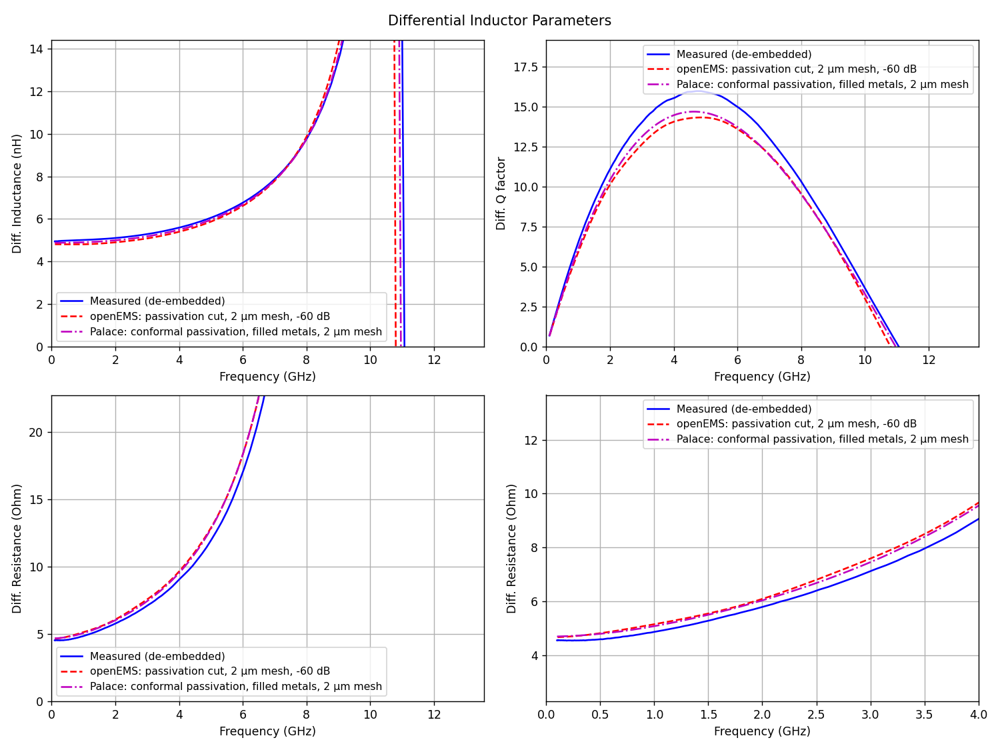

The two solvers agree with each other within:

- 0.3% in low-frequency resistance;
- 1.7% in inductance;
- 1.9% in peak Q;
- 1.2% in SRF.

Both deviate from the measurement the same way: low-frequency resistance about 3% high, inductance 2–4% low, and peak Q 7–9% low. The SRF is 0.1% high for openEMS and 1.3% high for Palace.

Both use the **"passivation cut" model** here: the correct SiO2 and passivation thickness in the valleys between TopMetal2 traces, without a conformal cover on top of and beside TopMetal2. The stackup files themselves differ, because the openEMS and Palace stackups follow different modelling rules. The gds2palace study recommends the full conformal passivation instead, which openEMS can't resolve at a practical cell size (see [the third error source](#third-error-source-non-planar-dielectrics-covering-topmetal2)). In Palace, the conformal model moves the SRF from 11.22 GHz to 10.96 GHz and peak Q from 14.83 to 14.67, at about twice the solve time (21 min 57 s).

Also note that the **meaning of refined_cellsize is different between both workflows**: in gds2openEMS this is about the **smallest** in-plane cellsize, geometry detail below this will be lost or clipped to the mesh (only thin layers still get smaller cells in z direction). In the gds2palace workflow, refined_cellsize is the **maximum** cellsize along the edges of the conductors, the actual mesh for small details can be much lower, only limited by the geometry itself. Same parameter names, but different meaning, so you usually need to use different values when switching between FDTD and FEM workflow! 

Time reported in the table is the time to get the full S-parameters over the full sweep, running on HP Z2 mini G2a with Ryzen AI Max+ 395 (Strix Halo) and 128 GB RAM. OpenEMS was set to automatic thread count, Palace was using 16 threads, with gds2palace 0.8.0 and its default `complex_coarse_solve` (without it, the same Palace model took 29 min 4 s).

## Files

- `run_*.py`: the openEMS model scripts. Results go to `output/`, which is not in git.
- `results/*.s2p`: the S-parameters used in this README. `palace_L6n2_with_ports_2um_passicut.s2p` is copied from the gds2palace study (`more_accurate_models_L6n2_v2`).
- `results/plot_study.py`: regenerates the L/Q/R plots in `results/plots/` from those files.
- `results/plot_time_signals.py`: regenerates the excitation spectrum and port voltage plots. It needs the raw time signals in `output/`, so rerun `run_L6n2_mergecorrection_sweep.py` first.
