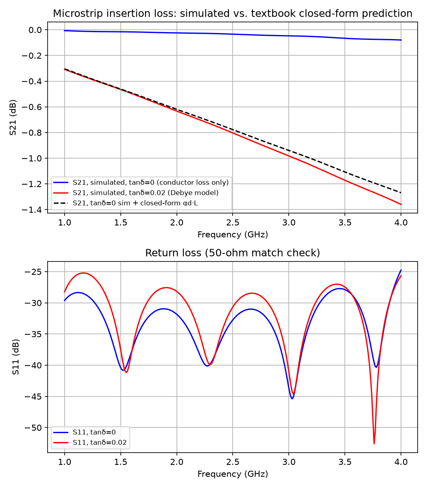

# Textbook microstrip dielectric attenuation vs. simulation

A minimal, fully self-contained check of the new `DielectricLossTangent` → dispersive Debye
model feature (see [`../../doc/XML_stackup_format.md`](../../doc/XML_stackup_format.md#dielectric-loss-tangent--dispersive-materials)):
a single straight 50-ohm microstrip line, simulated with and without the dielectric loss
tangent, compared against the standard closed-form microstrip design and attenuation
equations given in every microwave engineering textbook (e.g. Pozar, *Microwave Engineering*,
Ch. 3, "Microstrip Line"). Nothing here is reverse-engineered from a paper's figure or
measurement — every number is either a standard textbook formula or this example's own design
choice, so "the right answer" is known exactly, by construction.

(Two more ambitious examples - reproducing a published Rogers RO4350 hairpin filter and an
RT/duroid dual-mode SIR filter exactly, measurement and simulated data included - were
attempted first, but the coupled-resonator geometries proved too easy to get subtly wrong when
reconstructed from text dimensions alone, without the original artwork. This example replaces
that approach with one where the geometry is trivial enough to get right the first time.)

## Design

Substrate: Pozar's Table 3.1-style "typical FR4 (G10)" values - relative permittivity
εr=4.3, loss tangent tanδ=0.02, substrate thickness h=1.6mm (a standard PCB thickness).
Copper: real conductivity (5.8e7 S/m), 35µm (1oz) thick, both for the ground plane and the
trace - so a conductor-loss contribution is present in *every* run, lossy-dielectric or not,
and isolating the dielectric-loss effect means comparing the two runs against each other, not
comparing either one against zero loss.

The 50-ohm trace width was synthesized from the closed-form Hammerstad equations
(`results/microstrip_design.py`), the standard microstrip synthesis formulas given in Pozar
Ch. 3 (and in virtually every other microwave textbook/CAD tool, e.g. the widely used
"TXLine"-style microstrip calculators):

| Quantity | Value |
|---|---|
| W/h (synthesized) | 1.9449 |
| W | 3111.8 µm |
| εeff | 3.2662 |
| Self-consistency check: forward Z0(W/h) | 50.24 Ω (target 50 Ω - the ~0.5% gap is the Hammerstad formula's own well-known approximation error, not a bug) |

Line length: 100 mm, chosen simply to make the expected dielectric loss (a few tenths to ~1 dB
over the 1-4 GHz sweep) comfortably measurable from the simulated S21, without needing an
exotic mesh or a long run.

The same closed-form equations also give the dielectric attenuation constant at any frequency
(the standard Pozar-style formula, independently cross-checked against the literature):

```
alpha_d = k0 * eps_r * (eps_eff - 1) * tan(delta) / (2 * sqrt(eps_eff) * (eps_r - 1))     [Np/m]
```

No stackup XML change was needed to exercise the new feature - `FR4_microstrip_lossy.xml`
simply declares `DielectricLossTangent="0.02"` on the FR4 material like any other stackup file
would, and `setupSimulation()` picks it up automatically because the model script passes
`settings['fstart']`/`settings['fstop']`.

## Geometry

No GDSII file - the line, ground plane and via ports are built directly in Python with
`allpolygons.add_rectangle()`, the same way as
[`workflow/run_line_noGDSII.py`](../../workflow/run_line_noGDSII.py). Two stackup XML files,
identical except for one attribute: `FR4_microstrip_lossless.xml`
(`DielectricLossTangent="0.0"`) and `FR4_microstrip_lossy.xml` (`DielectricLossTangent="0.02"`).

## Results

`run_microstrip_attenuation.py lossless` and `run_microstrip_attenuation.py lossy` each run in
well under a minute (112k FDTD cells, single-port excitation with symmetry assumed). Comparing
the *difference* between the two simulated S21 curves against the closed-form αd·L prediction
isolates exactly the effect the new feature adds - the conductor-loss contribution, present
identically in both runs, cancels out of the comparison:

| f (GHz) | Predicted αd·L (dB) | Simulated extra loss, lossy − lossless (dB) | Relative error |
|---|---|---|---|
| 1.00 | 0.297 | 0.301 | +1.2% |
| 2.00 | 0.595 | 0.608 | +2.2% |
| 3.00 | 0.892 | 0.935 | +4.8% |
| 4.00 | 1.190 | 1.280 | +7.6% |



The error growing with frequency is expected, not a defect, for two independent reasons:

1. **Causality (Kramers-Kronig), by design.** As explained in
   [`doc/dielectric_loss_tangent_implementation_report.md`](../../doc/dielectric_loss_tangent_implementation_report.md#4-the-causality-tradeoff-and-why-its-not-a-bug),
   a causal wideband Debye fit that keeps tanδ close to its nominal value across a band cannot
   also keep εr perfectly flat - some roll-off is physically unavoidable, and it grows with
   frequency away from the fit's low-frequency end. The closed-form textbook formula, by
   contrast, assumes a frequency-*independent* tanδ (and εeff), which is itself an
   approximation that gets less accurate at higher frequency on real dielectrics - so some of
   this gap is actually the textbook formula being the less accurate one, not the simulation.
2. **Mesh/dispersion error**, which also grows with frequency on any fixed FDTD mesh (this
   model used a deliberately quick, not mesh-converged, setup - `refined_cellsize=200µm`,
   `cells_per_wavelength=15` - to keep the example fast; a finer mesh would narrow this gap
   somewhat, at the cost of a longer run, see e.g.
   [`more_examples/measured_vs_simulated/more_accurate_models_L6n2/`](../measured_vs_simulated/more_accurate_models_L6n2/)
   for how much that convergence work actually involves on a more demanding model).

Both effects point the same direction (more deviation at higher frequency), and a 1-8%
deviation from a closed-form textbook formula - itself only accurate to a few percent - over a
4:1 frequency sweep is a reasonable, explainable result, not a cause for concern.

## Files

- `FR4_microstrip_lossless.xml` / `FR4_microstrip_lossy.xml`: the two stackup variants.
- `run_microstrip_attenuation.py [lossless|lossy]`: builds and runs the model, writes
  `results/sparams_<variant>.npz` and a `.s2p` Touchstone file.
- `results/microstrip_design.py`: the closed-form synthesis/attenuation calculation (standalone,
  reproduces the design table above and the self-consistency check).
- `results/plot_comparison.py`: regenerates `results/plots/microstrip_attenuation_comparison.png`
  from the two `.npz` files.
